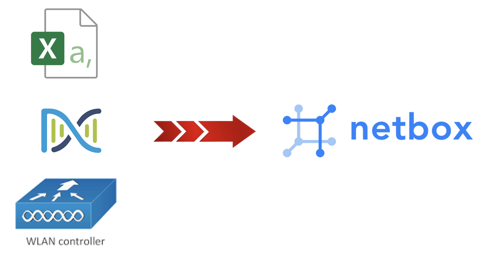

<!-- Improved compatibility of back to top link: See: https://github.com/othneildrew/Best-README-Template/pull/73 -->
<a name="readme-top"></a>

<!-- PROJECT SHIELDS -->
<!--
*** I'm using markdown "reference style" links for readability.
*** Reference links are enclosed in brackets [ ] instead of parentheses ( ).
*** See the bottom of this document for the declaration of the reference variables
*** for contributors-url, forks-url, etc. This is an optional, concise syntax you may use.
*** https://www.markdownguide.org/basic-syntax/#reference-style-links
-->
[![Contributors][contributors-shield]][contributors-url]
[![Forks][forks-shield]][forks-url]
[![Stargazers][stars-shield]][stars-url]
[![Issues][issues-shield]][issues-url]
[![MIT License][license-shield]][license-url]
[![LinkedIn][linkedin-shield]][linkedin-url]


<!-- PROJECT LOGO -->
<br />
<div align="center">
  <a href="https://github.com/jasoncdavis/import2netbox">
    
  </a>

<h3 align="center">import2netbox</h3>

  <p align="center">
    Import2NetBox is a project providing several Python scripts that import
    devices from various sources, such as Excel CSV file, Cisco Wirless LAN
    Controller (WLC) and Cisco Catalyst Center into NetBox for asset
    management and source-of-truth inventory.  These scripts are used by 
    the CiscoLive NOC team for tracking device state and intent.  The 
    NetBox APIs allow for cross-product integrations that influence
    configuration and network monitoring changes. 
    <br />
    ·
    <a href="https://github.com/jasoncdavis/import2netbox/issues/new?labels=bug&template=bug-report---.md">Report Bug</a>
    ·
    <a href="https://github.com/jasoncdavis/import2netbox/issues/new?labels=enhancement&template=feature-request---.md">Request Feature</a>
    ·
  </p>
</div>


<!-- TABLE OF CONTENTS -->
<details>
  <summary>Table of Contents</summary>
  <ol>
    <li>
      <a href="#about-the-project">About The Project</a>
      <ul>
        <li><a href="#built-with">Built With</a></li>
      </ul>
    </li>
    <li>
      <a href="#getting-started">Getting Started</a>
      <ul>
        <li><a href="#prerequisites">Prerequisites</a></li>
        <li><a href="#installation">Installation</a></li>
      </ul>
    </li>
    <li><a href="#usage">Usage</a></li>
    <li><a href="#roadmap">Roadmap</a></li>
    <li><a href="#contributing">Contributing</a></li>
    <li><a href="#license">License</a></li>
    <li><a href="#contact">Contact</a></li>
    <li><a href="#acknowledgments">Acknowledgments</a></li>
  </ol>
</details>


<!-- ABOUT THE PROJECT -->
## About The Project

[![import2netbox Screen Shot][product-screenshot]](https://example.com)


<p align="right">(<a href="#readme-top">back to top</a>)</p>


### Built With

* [![Python][Python-shield]][Python-url]
* [![NetBox][Netbox-shield]][Netbox-url]

* [![Excel CSV][Excel-shield]][Excel-url]
* [![Cisco WLC][CiscoWLC-shield]][WLC-url]
* [![PyPi FuzzyWuzzy][Fuzzywuzzy-shield]][Fuzzywuzzy-url]
* [![PyPi PyNetBox][Pynetbox-shield]][Pynetbox-url]

<p align="right">(<a href="#readme-top">back to top</a>)</p>


<!-- GETTING STARTED -->
## Getting Started

You might not use all parts of this project.  The X script is used to import devices from an Excel spreadsheet (as CSV) into NetBox.  The template XSLT file is in the project as [File].
The Y script is used to import devices from Cisco Cataylst Center into NetBox. There are more detailed instructions later in the README for handling Site/Location and Device-Type mappings.
The Z script is used to import wireless access points from the Cisco Wireless LAN Controller (WLC) into NetBox.

### Prerequisites

A NetBox server is a prerequisite. The project was developed using the NetBox v3.7.4.  It is unknown if the newest v4.0 has fully equivalent API calls yet.


### Installation

1. Clone the repo
   ```sh
   git clone https://github.com/jasoncdavis/import2netbox.git
   ```
2. Create a Python virtual environment.  The dnacentersdk has issues (as of May 24) with Python 3.12, so development was done using Python 3.11.  Track [THIS](https://github.com/cisco-en-programmability/dnacentersdk/issues/145) dnacentersdk project issue to follow any fixes.

   ```sh
   cd import2netbox
   python3.11 -m venv .venv
   source .venv/bin/activate
   ```
3. Install Python package dependencies from PyPi
   ```sh
   python -m pip install --upgrade pip
   pip install -r requirements.txt
   ```

<p align="right">(<a href="#readme-top">back to top</a>)</p>


<!-- USAGE EXAMPLES -->
## Usage

The cc2netbox.py script runs in 2 modes.  The first mode, without command-line arguments will generate device-type and site/location mapping files.

```sh
   python cc2netbox.py
   ```

```sh
   python import_csv2nb.py -f filename.csv
   ```

_For more examples, please refer to the [Documentation](https://example.com)_

<p align="right">(<a href="#readme-top">back to top</a>)</p>


<!-- ROADMAP -->
## Roadmap

- [ ] Feature 1 TBD
- [ ] Feature 2 TBD
- [ ] Feature 3 TBD

See the [open issues](https://github.com/jasoncdavis/import2netbox/issues) for a full list of proposed features (and known issues).

<p align="right">(<a href="#readme-top">back to top</a>)</p>


<!-- CONTRIBUTING -->
## Contributing

Contributions are what make the open source community such an amazing place to learn, inspire, and create. Any contributions you make are **greatly appreciated**.

If you have a suggestion that would make this better, please fork the repo and create a pull request. You can also simply open an issue with the tag "enhancement".
Don't forget to give the project a star! Thanks again!

1. Fork the Project
2. Create your Feature Branch (`git checkout -b feature/AmazingFeature`)
3. Commit your Changes (`git commit -m 'Add some AmazingFeature'`)
4. Push to the Branch (`git push origin feature/AmazingFeature`)
5. Open a Pull Request

<p align="right">(<a href="#readme-top">back to top</a>)</p>


<!-- LICENSE -->
## License

Distributed under the Apache License Version 2.0 License. See `LICENSE` for more information.

<p align="right">(<a href="#readme-top">back to top</a>)</p>


<!-- CONTACT -->
## Contact

Jason Davis - [@SNMPguy](https://twitter.com/SNMPguy) - jadavis@cisco.com

Project Link: [https://github.com/jasoncdavis/import2netbox](https://github.com/jasoncdavis/import2netbox)

<p align="right">(<a href="#readme-top">back to top</a>)</p>


<!-- ACKNOWLEDGMENTS -->
## Acknowledgments

* [NetBox](https://github.com/netbox-community/netbox)
* [Cisco Catalyst Center](https://developer.cisco.com/catalyst-center/)
* []()

<p align="right">(<a href="#readme-top">back to top</a>)</p>


<!-- MARKDOWN LINKS & IMAGES -->
<!-- https://www.markdownguide.org/basic-syntax/#reference-style-links -->
[contributors-shield]: https://img.shields.io/github/contributors/jasoncdavis/import2netbox.svg?style=for-the-badge
[contributors-url]: https://github.com/jasoncdavis/import2netbox/graphs/contributors
[forks-shield]: https://img.shields.io/github/forks/jasoncdavis/import2netbox.svg?style=for-the-badge
[forks-url]: https://github.com/jasoncdavis/import2netbox/network/members
[stars-shield]: https://img.shields.io/github/stars/jasoncdavis/import2netbox.svg?style=for-the-badge
[stars-url]: https://github.com/jasoncdavis/import2netbox/stargazers
[issues-shield]: https://img.shields.io/github/issues/jasoncdavis/import2netbox.svg?style=for-the-badge
[issues-url]: https://github.com/jasoncdavis/import2netbox/issues
[license-shield]: https://img.shields.io/github/license/jasoncdavis/import2netbox.svg?style=for-the-badge
[license-url]: https://github.com/jasoncdavis/import2netbox/blob/master/LICENSE.txt
[linkedin-shield]: https://img.shields.io/badge/-LinkedIn-black.svg?style=for-the-badge&logo=linkedin&colorB=555
[linkedin-url]: https://linkedin.com/in/jasoncdavis
[product-screenshot]: images/screenshot.png

[Python-shield]: https://img.shields.io/badge/python-3670A0?style=for-the-badge&logo=python&logoColor=ffdd54
[Python-url]: https://www.python.org/
[Netbox-shield]: https://img.shields.io/badge/NetBox-3.7.4-blue
[Netbox-url]: https://github.com/netbox-community/netbox

[Excel-shield]: https://img.shields.io/badge/Microsoft_Excel-217346?logo=microsoft-excel&logoColor=white
[Excel-url]: https://www.microsoft.com/en-us/microsoft-365/excel
[CiscoWLC-shield]: https://img.shields.io/badge/WLC--brightgreen?logo=cisco
[WLC-url]: https://www.cisco.com/site/us/en/products/networking/wireless/wireless-lan-controllers/index.html
[Fuzzywuzzy-shield]: https://img.shields.io/pypi/v/fuzzywuzzy?label=fuzzywuzzy
[Fuzzywuzzy-url]: https://pypi.org/project/fuzzywuzzy/
[Pynetbox-shield]: https://img.shields.io/pypi/v/pynetbox?label=pynetbox
[Pynetbox-url]: https://pypi.org/project/pynetbox/
